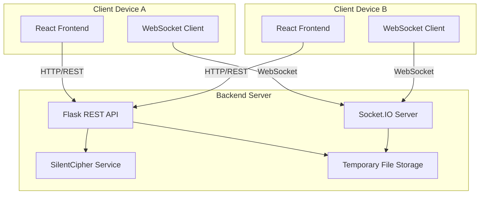

# Design Document

## Overview

The Audio Watermarking Demo is a full-stack web application that showcases Sony's SilentCipher audio watermarking technology. The application consists of a React-based frontend providing an intuitive user interface and a Flask-based backend that interfaces with the SilentCipher Python library. The system supports encoding custom messages (numeric, text, or binary) into audio files, decoding watermarks, optional distortion testing, and cross-device audio sharing for demonstration purposes.

The architecture follows a client-server model with RESTful API communication for standard operations and WebSocket connections for real-time device-to-device audio transfer.

**Design Rationale:** The web-based architecture was chosen to provide maximum accessibility and ease of demonstration across different devices. The separation of frontend and backend allows for independent scaling and the potential to swap backend providers in the future.

In addition to the web application, the system includes a standalone demo interface (CLI or Tkinter-based) that allows developers to quickly test watermarking functionality directly from the IDE without running the full web stack. This standalone interface shares the same backend services and SilentCipher integration as the web application, ensuring consistency in watermarking behavior.

**Design Rationale for Standalone Interface:** The standalone interface addresses the need for rapid testing and development workflows. By reusing the same backend services, we avoid code duplication and ensure that both interfaces produce identical watermarking results. The CLI/Tkinter approach provides a lightweight alternative for developers who need quick validation without browser overhead.

## Architecture

### High-Level Architecture



### Technology Stack

**Frontend (Web Application):**
- React 18+ with TypeScript
- React Router for navigation and route protection
- Tailwind CSS for styling with gradient backgrounds, shadows, and animations
- Axios for HTTP requests
- Socket.IO Client for WebSocket communication
- Web Audio API for audio playback and visualization
- Wavesurfer.js for waveform visualization

**Design Rationale:** React with TypeScript provides type safety and component reusability. Tailwind CSS enables rapid development of modern, responsive UIs with consistent design patterns. React Router handles authentication-based route protection seamlessly.

**Standalone Interface:**
- Python 3.8+ (CLI or Tkinter)
- Argparse for CLI argument parsing
- Tkinter for optional GUI (if not CLI-only)
- Direct integration with backend services (no HTTP layer)

**Design Rationale:** The standalone interface bypasses the HTTP API layer and directly invokes backend services for faster execution. CLI is prioritized for simplicity, with Tkinter as an optional enhancement for users who prefer a graphical interface.

**Backend:**
- Flask 3.0+ (Python 3.8+)
- Flask-CORS for cross-origin support
- Flask-SocketIO for WebSocket support
- SilentCipher library for watermarking
- Librosa for audio processing
- NumPy for numerical operations

**Design Rationale:** Flask provides a lightweight, flexible framework suitable for both API serving and standalone service invocation. The modular service architecture allows the standalone interface to import and use the same services without HTTP overhead.

### Deployment Architecture

- Frontend: Static hosting (can be served via Flask or separate CDN)
- Backend: Python server with GPU support (optional, for faster processing)
- File Storage: Temporary directory with automatic cleanup
- WebSocket: Socket.IO for real-time communication

## Components and Interfaces

### Frontend Components

#### 0. Navigation and Layout Components

**Navbar Component:**
- **Responsibility**: Provide site-wide navigation and authentication controls
- **Props**:
  - `isAuthenticated`: boolean
  - `onLogout`: () => void
- **Features**:
  - Responsive navigation menu (desktop and mobile)
  - Dynamic links based on authentication state
  - Active route highlighting
  - Mobile hamburger menu

**Footer Component:**
- **Responsibility**: Display footer information and links
- **Features**:
  - Brand information and social links
  - Quick navigation links
  - Resource links
  - Copyright information

#### 0.1. Page Components

**HomePage:**
- **Responsibility**: Landing page with feature showcase
- **Props**:
  - `isAuthenticated`: boolean
- **Sections**:
  - Hero section with call-to-action
  - Features grid
  - How it works section
  - CTA section (for unauthenticated users)

**LoginPage:**
- **Responsibility**: User authentication interface
- **Props**:
  - `onLogin`: (email: string, password: string) => void
- **State**:
  - `email`: string
  - `password`: string
  - `isLoading`: boolean
  - `error`: string | null
- **Features**:
  - Email and password inputs with validation
  - Form submission with loading state
  - Error display for invalid credentials
  - Social login buttons (placeholder for future)
  - Demo mode notice
  - Modern gradient design with smooth animations
- **Validation**:
  - Email format validation
  - Password minimum length check
  - Display inline validation errors

**Design Rationale:** Simple form-based authentication is sufficient for a demo application. The authentication can be enhanced later with real backend validation, but for now focuses on demonstrating the UI flow and route protection. The modern design with gradients and animations aligns with the overall application aesthetic.

**AboutPage:**
- **Responsibility**: Information about the technology
- **Sections**:
  - Technology overview
  - Use cases
  - Technical specifications
  - Team information

**EncodePage:**
- **Responsibility**: Audio encoding workflow
- **Features**:
  - Message input component
  - Audio upload (placeholder)
  - Encode button
  - Protected route (requires authentication)

**DecodePage:**
- **Responsibility**: Audio decoding workflow
- **Features**:
  - Audio upload (placeholder)
  - Decode button
  - Results display (placeholder)
  - Protected route (requires authentication)

#### 1. App Component
- **Responsibility**: Root component managing global state, routing, and authentication
- **State**:
  - `isAuthenticated`: boolean (authentication status)
  - `backendProvider`: Selected backend service (default: 'silentcipher')
  - `deviceSession`: Unique device identifier
  - `socketConnection`: WebSocket connection status
- **Props**: None (root component)
- **Methods**:
  - `handleLogin(email, password)`: Authenticate user and update state
  - `handleLogout()`: Clear authentication state and redirect to home
  - `initializeDeviceSession()`: Generate unique device identifier on mount
  - `initializeSocketConnection()`: Establish WebSocket connection
- **Routing**:
  - `/` - HomePage (public)
  - `/login` - LoginPage (public)
  - `/about` - AboutPage (public)
  - `/encode` - EncodePage (protected - requires authentication)
  - `/decode` - DecodePage (protected - requires authentication)
- **Route Protection**:
  - Protected routes check `isAuthenticated` state
  - Unauthenticated users are redirected to `/login`
  - After successful login, users are redirected to `/encode`

**Design Rationale:** Centralized authentication state in the App component simplifies state management and ensures consistent authentication checks across all routes. React Router's route protection pattern provides a clean separation between public and protected content.

#### 2. MessageInput Component
- **Responsibility**: Handle message input in multiple formats
- **Props**:
  - `onMessageChange`: (message: MessagePayload) => void
  - `messageType`: 'numeric' | 'text' | 'binary'
- **State**:
  - `messageType`: Current input mode
  - `numericValues`: number[] (5 integers 0-255)
  - `textValue`: string
  - `binaryValue`: string (40 bits)
- **Methods**:
  - `validateNumeric()`: Validate numeric array input
  - `convertTextToPayload()`: Convert text to numeric array
  - `convertBinaryToPayload()`: Convert binary string to numeric array
  - `generateRandom()`: Generate random message

#### 3. AudioUploader Component
- **Responsibility**: Handle audio file upload and validation
- **Props**:
  - `onFileUpload`: (file: File, metadata: AudioMetadata) => void
  - `acceptedFormats`: string[]
- **State**:
  - `selectedFile`: File | null
  - `audioMetadata`: { duration, sampleRate, channels }
- **Methods**:
  - `validateFile()`: Check format and size
  - `extractMetadata()`: Get audio properties

#### 4. AudioPlayer Component
- **Responsibility**: Play audio and display waveform
- **Props**:
  - `audioUrl`: string
  - `label`: string
  - `showWaveform`: boolean
- **State**:
  - `isPlaying`: boolean
  - `currentTime`: number
  - `duration`: number
- **Methods**:
  - `play()`: Start playback
  - `pause()`: Pause playback
  - `seek()`: Jump to position

#### 5. EncoderPanel Component
- **Responsibility**: Manage encoding workflow
- **Props**:
  - `backendProvider`: string
- **State**:
  - `originalAudio`: File | null
  - `message`: MessagePayload
  - `encodedAudio`: Blob | null
  - `sdrValue`: number | null
  - `isEncoding`: boolean
- **Methods**:
  - `encodeAudio()`: Call backend API to encode
  - `downloadEncoded()`: Download watermarked file
  - `shareAudio()`: Generate share link

#### 6. DecoderPanel Component
- **Responsibility**: Manage decoding workflow
- **Props**:
  - `backendProvider`: string
- **State**:
  - `audioFile`: File | null
  - `decodedMessage`: number[] | null
  - `confidence`: number[] | null
  - `isDecoding`: boolean
  - `detectionStatus`: 'detected' | 'not_detected' | null
- **Methods**:
  - `decodeAudio()`: Call backend API to decode
  - `displayResults()`: Show decoded message

#### 7. DistortionPanel Component
- **Responsibility**: Apply audio distortions for testing
- **Props**:
  - `audioFile`: File
  - `onDistortionApplied`: (distortedAudio: Blob) => void
- **State**:
  - `distortionType`: 'noise' | 'compression' | 'resample'
  - `distortionParams`: object
  - `isProcessing`: boolean
- **Methods**:
  - `applyDistortion()`: Call backend to apply distortion
  - `resetDistortion()`: Clear distortion

#### 8. SharePanel Component
- **Responsibility**: Handle cross-device audio sharing
- **Props**:
  - `audioBlob`: Blob
  - `message`: MessagePayload
  - `socketConnection`: Socket
- **State**:
  - `shareCode`: string | null
  - `qrCodeUrl`: string | null
  - `isSharing`: boolean
- **Methods**:
  - `generateShareCode()`: Create unique share ID
  - `generateQRCode()`: Create QR code for sharing
  - `sendToDevice()`: Emit audio via WebSocket

#### 9. ReceivePanel Component
- **Responsibility**: Receive shared audio from other devices
- **Props**:
  - `socketConnection`: Socket
  - `onAudioReceived`: (audio: Blob, metadata: object) => void
- **State**:
  - `isListening`: boolean
  - `receivedAudio`: Blob | null
- **Methods**:
  - `listenForAudio()`: Subscribe to WebSocket events
  - `acceptAudio()`: Handle received audio

#### 10. BackendSelector Component
- **Responsibility**: Switch between backend providers
- **Props**:
  - `currentProvider`: string
  - `onProviderChange`: (provider: string) => void
- **State**:
  - `availableProviders`: Provider[]
- **Methods**:
  - `selectProvider()`: Change active backend

### Backend Components

#### 1. Flask Application (app.py)
- **Responsibility**: Main application entry point
- **Routes**:
  - `POST /api/encode`: Encode watermark
  - `POST /api/decode`: Decode watermark
  - `POST /api/distort`: Apply distortion
  - `GET /api/providers`: List available backends
  - `GET /api/health`: Health check
- **Configuration**:
  - CORS settings
  - File upload limits
  - Temporary storage path

#### 2. SilentCipherService (services/silentcipher_service.py)
- **Responsibility**: Interface with SilentCipher library
- **Methods**:
  - `encode_audio(audio_data, sample_rate, message)`: Embed watermark
  - `decode_audio(audio_data, sample_rate)`: Extract watermark
  - `get_model(model_type)`: Load SilentCipher model
- **Properties**:
  - `model_16k`: 16kHz model instance
  - `model_44k`: 44.1kHz model instance

#### 3. AudioProcessor (services/audio_processor.py)
- **Responsibility**: Audio manipulation and validation
- **Methods**:
  - `load_audio(file_path)`: Load audio file
  - `save_audio(audio_data, sample_rate, file_path)`: Save audio
  - `validate_format(file)`: Check audio format
  - `get_metadata(audio_data, sample_rate)`: Extract properties
  - `apply_noise(audio_data, noise_level)`: Add noise
  - `apply_compression(audio_data, bitrate)`: Compress audio
  - `resample_audio(audio_data, source_rate, target_rate)`: Resample

#### 4. MessageConverter (utils/message_converter.py)
- **Responsibility**: Convert between message formats
- **Methods**:
  - `text_to_numeric(text)`: Convert text to numeric array
  - `binary_to_numeric(binary_str)`: Convert binary to numeric array
  - `numeric_to_text(numeric_array)`: Convert numeric to text
  - `numeric_to_binary(numeric_array)`: Convert numeric to binary
  - `validate_message(message, format)`: Validate message format

#### 5. ShareManager (services/share_manager.py)
- **Responsibility**: Manage audio sharing between devices
- **Methods**:
  - `create_share_session(audio_blob, metadata)`: Create share session
  - `get_share_session(share_code)`: Retrieve shared audio
  - `cleanup_expired_sessions()`: Remove old sessions
- **Properties**:
  - `active_sessions`: Dict of share code to audio data
  - `session_timeout`: 1 hour

#### 6. SocketIOHandler (websocket/socket_handler.py)
- **Responsibility**: Handle WebSocket events
- **Events**:
  - `connect`: Client connection
  - `disconnect`: Client disconnection
  - `join_session`: Join device session
  - `share_audio`: Send audio to session
  - `request_audio`: Request shared audio
- **Methods**:
  - `emit_to_session(session_id, event, data)`: Send to specific session
  - `broadcast_audio(audio_data, metadata)`: Broadcast to all clients

## Data Models

### Frontend Data Models

```typescript
// Message payload types
type MessagePayload = {
  format: 'numeric' | 'text' | 'binary';
  values: number[]; // Always 5 integers 0-255
  originalInput: string | number[];
};

// Audio metadata
interface AudioMetadata {
  duration: number;
  sampleRate: number;
  channels: number;
  format: string;
  size: number;
}

// Encoding result
interface EncodingResult {
  success: boolean;
  encodedAudio: Blob;
  sdr: number;
  message: number[];
  processingTime: number;
}

// Decoding result
interface DecodingResult {
  success: boolean;
  status: 'detected' | 'not_detected';
  message: number[] | null;
  confidence: number[] | null;
  processingTime: number;
}

// Backend provider
interface BackendProvider {
  id: string;
  name: string;
  description: string;
  features: string[];
  isAvailable: boolean;
}

// Share session
interface ShareSession {
  shareCode: string;
  qrCodeUrl: string;
  expiresAt: Date;
  deviceSession: string;
}

// Distortion parameters
interface DistortionParams {
  type: 'noise' | 'compression' | 'resample';
  noiseLevel?: number; // dB
  bitrate?: number; // kbps
  targetSampleRate?: number; // Hz
}
```

### Backend Data Models

```python
# Message payload
class MessagePayload:
    format: str  # 'numeric', 'text', 'binary'
    values: List[int]  # 5 integers 0-255
    original_input: Union[str, List[int]]

# Audio data
class AudioData:
    data: np.ndarray
    sample_rate: int
    channels: int
    duration: float

# Encoding request
class EncodeRequest:
    audio_file: FileStorage
    message: MessagePayload
    model_type: str  # '16k' or '44.1k'

# Encoding response
class EncodeResponse:
    success: bool
    encoded_audio: bytes
    sdr: float
    message: List[int]
    processing_time: float

# Decoding request
class DecodeRequest:
    audio_file: FileStorage
    model_type: str
    phase_shift_decoding: bool

# Decoding response
class DecodeResponse:
    success: bool
    status: str  # 'detected' or 'not_detected'
    message: Optional[List[int]]
    confidence: Optional[List[float]]
    processing_time: float

# Share session
class ShareSession:
    share_code: str
    audio_data: bytes
    metadata: dict
    created_at: datetime
    expires_at: datetime
```

## Error Handling

### Frontend Error Handling

1. **File Upload Errors**
   - Invalid format: Display supported formats
   - File too large: Show size limit
   - Corrupted file: Suggest re-upload

2. **API Communication Errors**
   - Network timeout: Retry with exponential backoff
   - Server error (5xx): Display error message with retry option
   - Client error (4xx): Show validation errors

3. **Audio Processing Errors**
   - Playback failure: Fallback to download option
   - Waveform rendering failure: Show simple player

4. **WebSocket Errors**
   - Connection lost: Auto-reconnect with notification
   - Share timeout: Clear share session

### Backend Error Handling

1. **File Processing Errors**
   - Invalid audio format: Return 400 with supported formats
   - Corrupted audio: Return 400 with error details
   - Processing failure: Return 500 with error message

2. **SilentCipher Errors**
   - Model loading failure: Return 503 with retry-after
   - Encoding failure: Return 500 with details
   - Decoding failure: Return 200 with status='not_detected'

3. **Resource Errors**
   - Out of memory: Return 507 with suggestion to reduce file size
   - Disk space: Return 507 with cleanup notification

4. **Validation Errors**
   - Invalid message format: Return 400 with validation details
   - Invalid parameters: Return 400 with parameter requirements

### Error Response Format

```typescript
interface ErrorResponse {
  success: false;
  error: {
    code: string;
    message: string;
    details?: any;
    retryable: boolean;
  };
}
```

## Testing Strategy

### Frontend Testing

1. **Unit Tests** (Jest + React Testing Library)
   - Component rendering
   - State management
   - Message conversion utilities
   - Validation functions

2. **Integration Tests**
   - API communication
   - WebSocket connection
   - File upload flow
   - Audio playback

3. **E2E Tests** (Cypress)
   - Complete encoding workflow
   - Complete decoding workflow
   - Cross-device sharing
   - Backend provider switching

### Backend Testing

1. **Unit Tests** (pytest)
   - Message conversion functions
   - Audio processing utilities
   - Validation logic
   - Model loading

2. **Integration Tests**
   - API endpoints
   - SilentCipher integration
   - File storage operations
   - WebSocket events

3. **Performance Tests**
   - Encoding speed
   - Decoding speed
   - Concurrent requests
   - Memory usage

### Manual Testing

1. **Audio Quality Testing**
   - Listen to original vs watermarked
   - Verify imperceptibility
   - Test different audio types

2. **Robustness Testing**
   - Apply various distortions
   - Verify watermark survival
   - Test edge cases

3. **Cross-Device Testing**
   - Share between devices
   - Verify audio integrity
   - Test network conditions

## Security Considerations

1. **File Upload Security**
   - Validate file types using magic numbers
   - Limit file size (50MB)
   - Sanitize filenames
   - Store in temporary directory with auto-cleanup

2. **API Security**
   - Rate limiting on endpoints
   - Input validation and sanitization
   - CORS configuration
   - No authentication required (demo app)

3. **WebSocket Security**
   - Session-based isolation
   - Automatic session expiry
   - No persistent storage of shared audio

4. **Data Privacy**
   - No user data collection
   - Temporary file cleanup after processing
   - No logging of audio content

## Performance Optimization

1. **Frontend Optimization**
   - Lazy load components
   - Debounce user inputs
   - Cache audio blobs
   - Optimize waveform rendering

2. **Backend Optimization**
   - Model caching (keep loaded in memory)
   - Async processing for long operations
   - Streaming for large files
   - Background cleanup tasks

3. **Network Optimization**
   - Compress API responses
   - Use WebSocket for real-time data
   - Implement request caching where appropriate

## Deployment Considerations

1. **Frontend Deployment**
   - Build optimized production bundle
   - Serve static files via CDN or Flask
   - Configure environment variables for API URL

2. **Backend Deployment**
   - Use WSGI server (Gunicorn) for production
   - Configure worker processes based on CPU
   - Set up GPU support if available
   - Configure file storage path
   - Set up automatic cleanup cron job

3. **Environment Variables**
   - `FLASK_ENV`: production/development
   - `MAX_FILE_SIZE`: 50MB
   - `TEMP_STORAGE_PATH`: /tmp/audio-watermark
   - `SESSION_TIMEOUT`: 3600 seconds
   - `CORS_ORIGINS`: Allowed origins

4. **Monitoring**
   - Log API requests and errors
   - Monitor processing times
   - Track memory usage
   - Alert on failures
